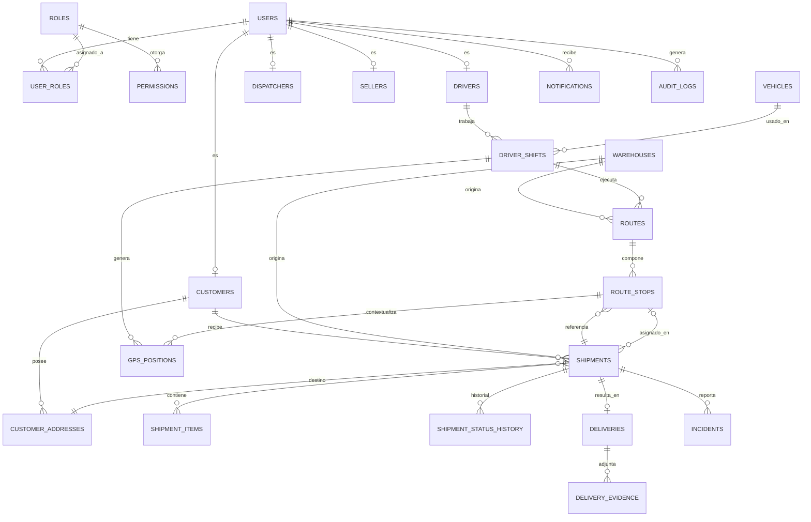

# Modelo de Base de Datos

## Diagrama Entidad-Relación (Mermaid)

## Tablas principales (resumen de columnas clave)

### users
`id, email, password_hash, full_name, phone, is_active, created_at, updated_at`

### roles / permissions / user_roles
RBAC clásico many-to-many: `user_roles(user_id, role_id)`,
`role_permissions(role_id, permission_id)`.

### customers
`id, user_id (nullable, si el cliente tiene login), business_name, tax_id, phone, email,
seller_id, created_at`

### customer_addresses
`id, customer_id, nombre, calle, numero, comuna, ciudad, region, codigo_postal,
latitud, longitud, contacto, telefono, observaciones, es_principal, activa`

### drivers / vehicles / warehouses
`drivers(id, user_id, license_number, license_expiry, active)`
`vehicles(id, plate, brand, model, capacity_kg, active)`
`warehouses(id, name, address, latitud, longitud)`

### shipments
`id, numero (DES-2026-000001), customer_id, address_id, seller_id, warehouse_id,
driver_id (nullable), vehicle_id (nullable), route_stop_id (nullable),
fecha_programada, hora_programada, prioridad, estado, tracking_code (UUID único),
observaciones, created_at, updated_at`

Índices: `numero` (único), `tracking_code` (único), `(estado, fecha_programada)`,
`customer_id`, `driver_id`.

### shipment_status_history
`id, shipment_id, estado_anterior, estado_nuevo, user_id, gps_lat, gps_lng,
observacion, created_at`

### routes / route_stops
`routes(id, driver_shift_id [NULO], driver_id, vehicle_id, warehouse_id, fecha, estado, created_at)`
`route_stops(id, route_id, shipment_id, orden, estado, eta, ata)`

`orden` define la secuencia editable por el despachador (drag & drop en el frontend).

**Nota de diseño (ajustada en Fase 7):** el diseño original ligaba `routes.driver_shift_id`
como NOT NULL, pero el flujo real (sección 61 del prompt) asigna despachos a un
chofer+vehículo **antes** de que exista una jornada activa. Se agregaron `driver_id`,
`vehicle_id` y `fecha` directos a `routes`, y `driver_shift_id` pasó a ser nullable —
se completa cuando el chofer efectivamente inicia su jornada (Fase 11).

### driver_shifts
`id, driver_id, vehicle_id, route_id, estado (INICIADA/EN_RUTA/REGRESANDO/FINALIZADA),
odometro_inicio, odometro_fin, iniciada_at, finalizada_at`

Este es el ancla temporal para separar "GPS del chofer" de otras jornadas del mismo chofer.

### gps_positions (append-only, particionable por fecha)
`id, driver_shift_id, vehicle_id, route_stop_id (nullable), latitude, longitude,
accuracy, speed, heading, battery_level, network_status, recorded_at, received_at`

`recorded_at` = hora del dispositivo; `received_at` = hora del servidor (detecta reenvíos
offline). Índice compuesto `(driver_shift_id, recorded_at)` para reproducción de ruta.

### deliveries / delivery_evidence
`deliveries(id, shipment_id, receptor_nombre, resultado (ENTREGADO/NO_ENTREGADO),
motivo_fallo, gps_lat, gps_lng, created_at)`
`delivery_evidence(id, delivery_id, tipo (FIRMA/FOTO), url, created_at)`

### incidents
`id, shipment_id, driver_id, tipo, descripcion, gps_lat, gps_lng, resuelto, created_at`

### notifications
`id, user_id, tipo, titulo, cuerpo, leido, created_at`

### audit_logs
`id, user_id, ip, accion, modulo, registro_id, valor_anterior (JSON), valor_nuevo (JSON),
created_at`

## Restricciones e integridad

- Todas las FK con `ON DELETE RESTRICT` salvo `gps_positions` y `audit_logs`
  (`ON DELETE CASCADE` desde `driver_shifts`/`users` respectivamente, por ser datos derivados).
- `CHECK` en `shipments.estado` limitado al enum de la máquina de estados (ver `states.md`).
- `UNIQUE (customer_id, es_principal) WHERE es_principal = true` vía índice parcial, para
  garantizar una sola dirección principal por cliente.

## Nota de implementación (encontrada durante pruebas de Fase 2)

Los tipos `ENUM` nativos de PostgreSQL (`shipment_status`, `driver_shift_status`,
`delivery_result`, `evidence_type`) no se eliminan automáticamente cuando Alembic hace
`drop_table` en el downgrade — quedan huérfanos y rompen un `upgrade` posterior con
`DuplicateObject`. La migración inicial incluye ahora un `DROP TYPE ... IF EXISTS` explícito
al final de `downgrade()` para cada enum. Verificado con un ciclo completo
`upgrade → downgrade → upgrade` sin errores.
