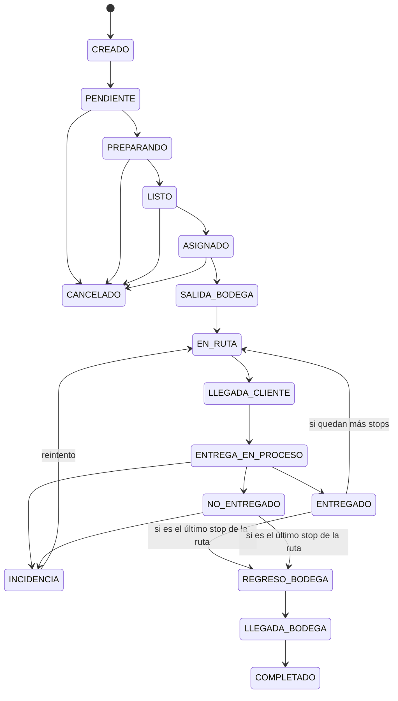

# Máquina de Estados del Despacho

## Estados

```
CREADO, PENDIENTE, PREPARANDO, LISTO, ASIGNADO, SALIDA_BODEGA, EN_RUTA,
LLEGADA_CLIENTE, ENTREGA_EN_PROCESO, ENTREGADO, NO_ENTREGADO, INCIDENCIA,
REGRESO_BODEGA, LLEGADA_BODEGA, COMPLETADO, CANCELADO
```

## Diagrama de transiciones (Mermaid)



## Tabla de transiciones válidas (fuente de verdad para el backend)

| Desde                | Hacia (permitido)                                   | Quién dispara |
|-----------------------|------------------------------------------------------|---------------|
| CREADO                | PENDIENTE                                             | sistema (al guardar) |
| PENDIENTE              | PREPARANDO, CANCELADO                                | vendedor/admin |
| PREPARANDO             | LISTO, CANCELADO                                     | bodega/admin |
| LISTO                  | ASIGNADO, CANCELADO                                  | despachador |
| ASIGNADO               | SALIDA_BODEGA, CANCELADO                             | despachador |
| SALIDA_BODEGA          | EN_RUTA                                              | sistema (al iniciar jornada / primer movimiento GPS) |
| EN_RUTA                | LLEGADA_CLIENTE                                      | sistema (geocerca) o chofer (manual) |
| LLEGADA_CLIENTE        | ENTREGA_EN_PROCESO                                   | chofer |
| ENTREGA_EN_PROCESO     | ENTREGADO, NO_ENTREGADO, INCIDENCIA                  | chofer |
| NO_ENTREGADO           | INCIDENCIA, REGRESO_BODEGA*                          | chofer/sistema |
| INCIDENCIA             | EN_RUTA (reintento), REGRESO_BODEGA*                 | despachador |
| ENTREGADO              | EN_RUTA (siguiente stop) o REGRESO_BODEGA*           | sistema (según si quedan stops pendientes en la ruta) |
| REGRESO_BODEGA         | LLEGADA_BODEGA                                       | sistema (geocerca bodega) o chofer (manual) |
| LLEGADA_BODEGA         | COMPLETADO                                           | chofer (Finalizar Jornada) |
| cualquiera pre-EN_RUTA | CANCELADO                                            | admin/despachador |

`*` REGRESO_BODEGA es una transición **de la ruta**, no del despacho individual — se dispara
cuando el último `route_stop` de la `route` activa cambia a ENTREGADO/NO_ENTREGADO. Los
despachos individuales quedan en su estado terminal (ENTREGADO/NO_ENTREGADO); REGRESO_BODEGA,
LLEGADA_BODEGA y COMPLETADO se registran a nivel de `driver_shift`/`route`, con reflejo en
`shipment_status_history` para trazabilidad del cliente en el timeline.

## Implementación

- Enum de Python (`ShipmentStatus`) + diccionario `VALID_TRANSITIONS: dict[status, set[status]]`
  en `services/`. Toda transición pasa por `ShipmentStateService.transition(shipment, nuevo_estado, user, gps=None)`,
  que valida contra el diccionario, escribe en `shipment_status_history` y emite el evento
  WebSocket correspondiente — nunca se actualiza `shipments.estado` con un UPDATE directo
  desde otro punto del código.
